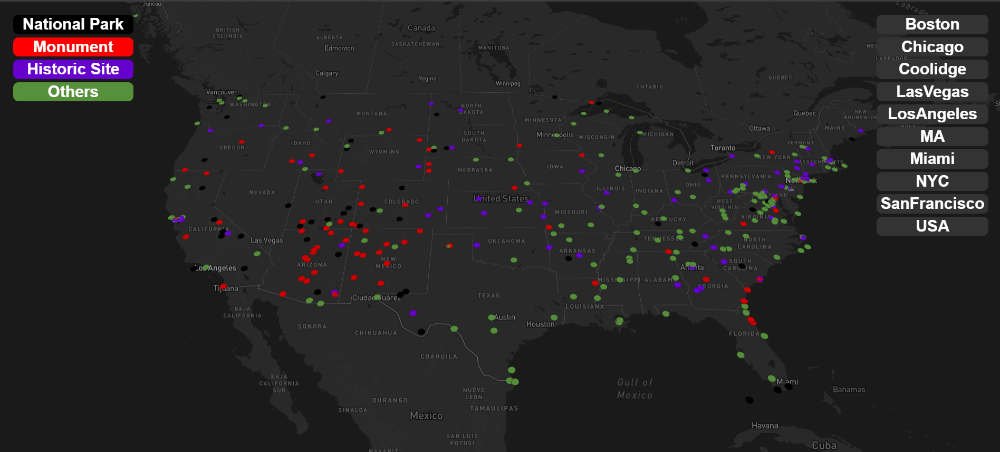
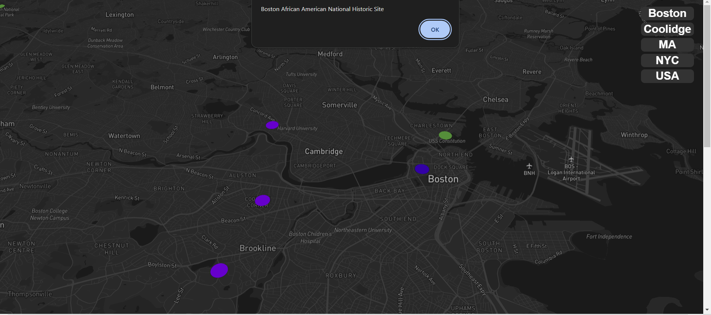
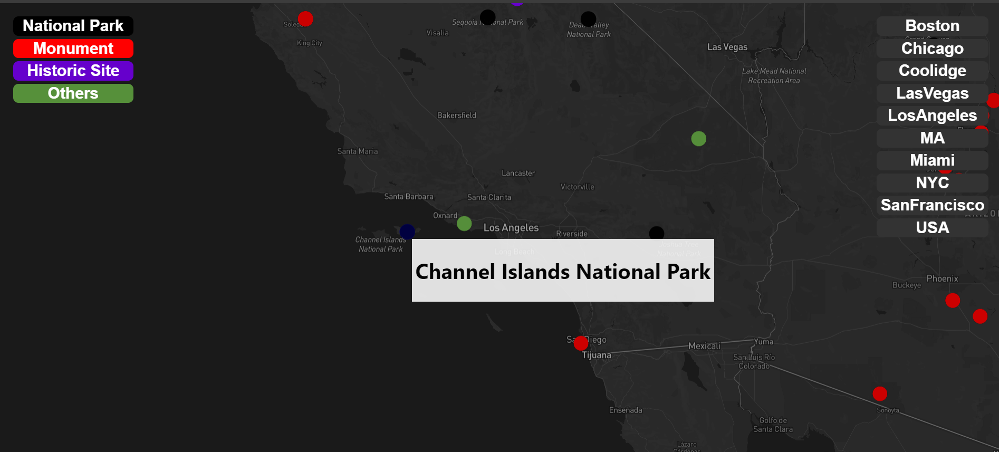
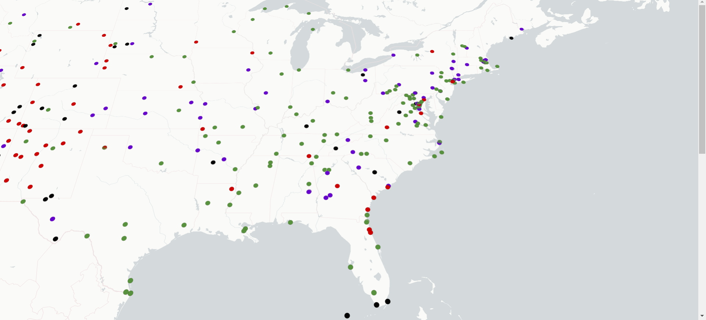

# DeckGL Map Visualization

This project demonstrates how to create a map visualization using DeckGL with React and Typescript.

## Final Output








## Setup Instructions

Follow these steps to set up the project locally:

### Prerequisites

Make sure you have Node.js and npm installed on your system. You can download and install them from [https://nodejs.org](https://nodejs.org).

### Clone the Repository

Clone this repository to your local machine using the following command:

```bash
git clone https://github.com/Rohan-Ver-ma/Mapbox-client-with-deck.gl.git
```

### Install Dependencies

Navigate to the project directory and install the dependencies using npm:

```bash
npm install
```
### Set Up Mapbox Access Token

You need a Mapbox access token to use the Map component. If you don't have one, sign up for a Mapbox account at https://www.mapbox.com and create a new access token.

Create a .env file in the project root directory and add your Mapbox access token .
If for some reason map style is not rendering in browser from using env variable you can directly insert the style in src/app.js MAP_STYLE variable in " " . This happens due to fact that mapbox map style is not very compatible with env variables.

```markfile
REACT_APP_MAPBOX_ACCESS_TOKEN=your_mapbox_access_token_here
```

### Changing Map Style

You can change the map style by replacing the URL in the **MAP_STYLE** constant defined in the App.js file. Update the URL to point to the desired map style from the Mapbox Styles API.

 Another Syle 

```markfile
  const MAP_STYLE = 'https://basemaps.cartocdn.com/gl/positron-nolabels-gl-style/style.json'; 
```

### Customizing Point Colors

To represent different data points with different colors, modify the getFillColor function in the GeoJsonLayer configuration in the App.tsx file. Update the logic inside the function to return different color arrays based on the properties of each feature.
**Black** represents National Parks , **Purple** represents monuments and **Green** represents other things.

## Run the Application

Once you have set up the Mapbox access token and made any desired changes to the map style and point colors, you can run the application locally using the following command:

```bash
npm start
```
This will start the development server and open the application in your default web browser. You should see the DeckGL map visualization with the provided data.

### Project Structure

The project structure is as follows:

- `src/`: Contains the source code for the application.
  - `App.tsx`: Main component that sets up the DeckGL map visualization.
  - `data.json`: Sample GeoJSON data for rendering map features.
  - `App.module.css`: Styles for the control buttons.
- `public/`: Contains public assets and the HTML template.
- `.env`: Environment variables configuration file (not included in the repository).
- `package.json`: Defines project dependencies and scripts.
- `tsconfig.json`:Complier that converts Typescript code into Javascript on run time .

## Thoughts after completing this
- ### Converting this project into Typescript was a little tough as resources regarding deck.gl in typescript was really less.
- ### But due to this adversity I became more competent in using Typescript.

## Things I learned from building this project
- ### Understood syntax of deck.gl with its tag  - <DeckGL> , <Map> and concepts .
- ### Creating a custom layer in deck.gl.
- ### Deep dived into things like ScatterplotLayer , GeoJsonLayer , ArcLayer.
- ### Working with data in JSON format.
- ### Implementing events like onClick , onHover . 


## From Here onwards
- ### Making some more complex project with deck.gl to understand it more .

